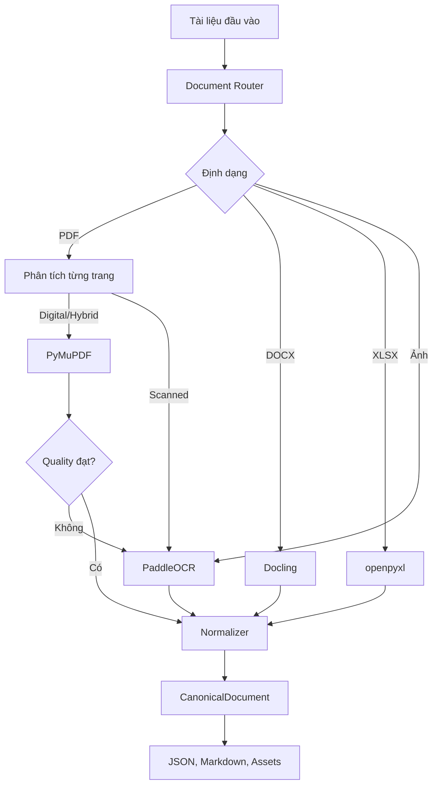

# RAG Document Parser

Pipeline Python dùng để đọc và chuẩn hóa tài liệu trước khi đưa vào hệ thống RAG. Project hỗ trợ PDF, DOCX, XLSX và ảnh PNG/JPG/JPEG; kết quả chính là JSON theo schema `CanonicalDocument`, kèm Markdown và các asset để kiểm tra.

Project hiện tập trung vào ingestion và parsing. Chunking, embedding, vector database và retrieval chưa nằm trong pipeline này.

## Yêu cầu

- Python 3.10–3.13; khuyến nghị Python 3.12
- Linux hoặc môi trường có PaddlePaddle wheel tương thích
- CPU chạy được toàn bộ pipeline; không bắt buộc GPU
- Internet trong lần cài dependency và tải model đầu tiên

## Chạy nhanh

Thực hiện các lệnh sau từ thư mục gốc của project:

```bash
python3.12 -m venv .venv
source .venv/bin/activate
python -m pip install --upgrade pip
python -m pip install -r requirements.txt
python scripts/download_ocr_models.py
python scripts/parse_test_documents.py --ocr-options config/ocr_scan_vi.json
```

Trên Windows PowerShell, kích hoạt môi trường bằng:

```powershell
.venv\Scripts\Activate.ps1
```

`requirements.txt` cài project ở chế độ editable cùng các extra DOCX, OCR và test. `constraints.txt` khóa các phiên bản đã được kiểm tra trên Python 3.12/Linux CPU.

Nếu Python trên Debian/Ubuntu không có `ensurepip`, có thể tạo môi trường bằng:

```bash
python3.12 -m venv --without-pip .venv
python -m pip --python .venv/bin/python install pip
source .venv/bin/activate
python -m pip install -r requirements.txt
```

Nếu việc cài PaddlePaddle từ PyPI gặp lỗi, cài CPU wheel trước rồi chạy lại requirements:

```bash
python -m pip install paddlepaddle==3.3.0 \
  --index-url https://www.paddlepaddle.org.cn/packages/stable/cpu/
python -m pip install -r requirements.txt
```

## Chuẩn bị dữ liệu

Đặt tài liệu cần xử lý vào thư mục `documents/`:

```text
documents/
  tai_lieu.pdf
  bao_cao.docx
  du_lieu.xlsx
  anh_scan.png
```

Các định dạng được hỗ trợ:

| Định dạng | Backend | Nội dung trích xuất |
| --- | --- | --- |
| PDF digital | PyMuPDF | Text, bảng, ảnh, font và bounding box |
| PDF scan | PaddleOCR PPStructureV3 | Layout, OCR, bounding box và ảnh trang |
| PDF hybrid | PyMuPDF | Native text và image assets |
| DOCX | Docling | Heading, đoạn văn, danh sách, bảng và ảnh |
| XLSX | openpyxl | Vùng bảng, giá trị, công thức và merged cells |
| PNG/JPG/JPEG | PaddleOCR PPStructureV3 | OCR, layout và bounding box |

## Tải model OCR

Profile tiếng Việt dùng ba nhóm model:

- Recognition tiếng Việt: `.cache/models/ppocrv6_vi/`
- Layout: `.cache/paddlex/official_models/PP-DocLayout-S/`
- Text detection: `.cache/paddlex/official_models/PP-OCRv5_mobile_det/`

Tải model recognition tiếng Việt bằng:

```bash
python scripts/download_ocr_models.py
```

Script tải bốn inference file từ model `tieubaoca/pp-ocrv6-medium-rec-vietnamese`, cố định revision và ghi checksum vào `model_manifest.json`. Model layout và detection được Paddle tải vào `.cache/paddlex/` khi OCR chạy lần đầu. Toàn bộ `.cache/` đã được loại khỏi Git.

Muốn lưu recognition model ở vị trí khác:

```bash
python scripts/download_ocr_models.py --output /duong/dan/model
```

Sau đó cập nhật `text_recognition_model_dir` trong file cấu hình OCR.

## Chạy parser

### Chạy với profile OCR tiếng Việt

Đây là lệnh khuyến nghị cho tập tài liệu có PDF scan hoặc ảnh tiếng Việt:

```bash
python scripts/parse_test_documents.py \
  --input documents \
  --output parsed_test_document \
  --ocr-options config/ocr_scan_vi.json
```

### Chạy với cấu hình mặc định

Nếu chỉ xử lý PDF digital, DOCX hoặc XLSX:

```bash
python scripts/parse_test_documents.py
```

Mặc định script đọc `documents/` và ghi vào `parsed_test_document/`. Các đường dẫn mặc định luôn được tính từ thư mục project, nên có thể gọi script từ working directory khác.

### Điều chỉnh DPI OCR

```bash
python scripts/parse_test_documents.py \
  --ocr-options config/ocr_scan_vi.json \
  --ocr-dpi 200
```

DPI mặc định là 150. Tăng DPI có thể giúp tài liệu chữ nhỏ nhưng sẽ dùng nhiều RAM và chạy lâu hơn.

### Chạy bằng Python API

```python
from pathlib import Path

from document_parser import DocumentPipeline

pipeline = DocumentPipeline()
summary = pipeline.parse_all(
    Path("documents"),
    Path("parsed_test_document"),
)
print(summary["counts"])
```

Nếu cần profile tiếng Việt qua API, đọc `config/ocr_scan_vi.json`, resolve các đường dẫn tương đối theo thư mục `config/`, rồi truyền dictionary vào `ParserConfig(ocr_options=...)`. Script CLI đã thực hiện bước resolve này tự động.

## Kết quả đầu ra

Mỗi tài liệu tạo một thư mục riêng:

```text
parsed_test_document/
  summary.json
  tai_lieu/
    document.json
    document.md
    assets/
```

- `document.json`: dữ liệu chuẩn để pipeline RAG sử dụng
- `document.md`: phiên bản dễ đọc để kiểm tra thủ công
- `assets/`: ảnh gốc, ảnh trích xuất và trang PDF được render cho OCR
- `summary.json`: trạng thái toàn batch, parser đã dùng, chất lượng và lỗi từng file/trang

Script trả exit code `0` khi tất cả file thành công và `1` khi không có input, có file lỗi hoặc có trang ở trạng thái partial. Một trang lỗi không làm dừng toàn bộ batch.

## Chạy test

Chạy toàn bộ test:

```bash
python -m pytest -q
```

Tách test nhanh và integration test:

```bash
python -m pytest -q -m 'not integration'
python -m pytest -q -m integration
```

Các test thông thường không yêu cầu GPU hoặc model OCR thật; OCR backend được giả lập ở những test phù hợp.

## Cấu hình OCR

Profile `config/ocr_scan_vi.json` dành cho tài liệu scan tiếng Việt dạng văn bản trên CPU. Profile sử dụng:

- `PP-DocLayout-S` cho layout
- `PP-OCRv5_mobile_det` cho text detection
- `PP-OCRv6_medium_rec` với model tiếng Việt cho recognition
- Tắt orientation, unwarping, region detection, table recognition và formula recognition

Table recognition bị tắt vì profile này ưu tiên scan văn bản. Việc trích xuất bảng native từ PDF digital và XLSX vẫn hoạt động. Nếu tài liệu scan có bảng, tạo một file JSON khác và bật `use_table_recognition`.

Ví dụ cấu hình OCR tối giản:

```json
{
  "device": "cpu",
  "cpu_threads": 4,
  "enable_mkldnn": false,
  "use_doc_orientation_classify": false,
  "use_doc_unwarping": false,
  "use_textline_orientation": false,
  "use_formula_recognition": false
}
```

Chạy bằng file cấu hình riêng:

```bash
python scripts/parse_test_documents.py --ocr-options ocr_options.json
```

## Luồng xử lý



PDF được phân loại theo từng trang. Pipeline ưu tiên native extraction khi text đủ tốt và chỉ fallback sang OCR cho trang scan hoặc trang không đạt quality check. OCR thay thế text native trên trang fallback để tránh dữ liệu trùng.

## Cấu trúc project

```text
config/                     Cấu hình PaddleOCR và profile tiếng Việt
documents/                  Tài liệu đầu vào mặc định
scripts/
  download_ocr_models.py    Tải model recognition tiếng Việt
  parse_test_documents.py   CLI chạy parser theo batch
src/document_parser/
  loader/                   Đọc và kiểm tra file
  router/                   Chọn parser, phân loại trang PDF
  parsers/                  PDF, DOCX, XLSX và image adapters
  normalization/            Canonical schema và normalizer
  quality/                  Kiểm tra chất lượng extraction
  utils/                    Serialization và file utilities
tests/                      Unit và integration tests
```

## Lỗi thường gặp

**`Cannot initialize PPStructureV3`**

Kiểm tra môi trường đã được activate và chạy lại:

```bash
python -m pip install -r requirements.txt
python scripts/download_ocr_models.py
```

**Không tìm thấy model tiếng Việt**

Kiểm tra file sau tồn tại:

```bash
ls .cache/models/ppocrv6_vi/inference.pdiparams
```

Sau đó chạy parser với `--ocr-options config/ocr_scan_vi.json`.

**Paddle báo lỗi OneDNN/PIR trên CPU**

Profile mặc định đã tắt MKLDNN cho pipeline. Nếu lỗi xuất hiện trong recognition model, bỏ phần `engine_config` của `TextRecognition` trong `config/ocr_pp_structure_vi.yaml` để dùng CPU backend thông thường.

**Script kết thúc với exit code 1**

Mở `parsed_test_document/summary.json` để xem `failed`, `partial`, `failed_pages` và thông báo lỗi tương ứng.

## Giới hạn hiện tại

- Reading order và heading của PDF digital dựa trên heuristic, có thể sai ở layout nhiều cột.
- PDF hybrid chưa OCR chọn lọc từng vùng ảnh.
- DOCX thường không có page number hoặc bounding box thật.
- openpyxl không tự tính lại công thức Excel.
- OCR tiếng Việt vẫn có thể sai dấu, số, ký tự và thứ tự đọc.
- Quality check đánh giá cấu trúc và chất lượng text cơ bản, chưa đo CER/WER.

Kết quả kiểm thử trên bộ tài liệu mẫu nằm trong `PARSE_REPORT.md`.
