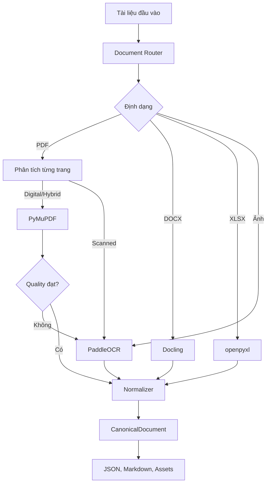
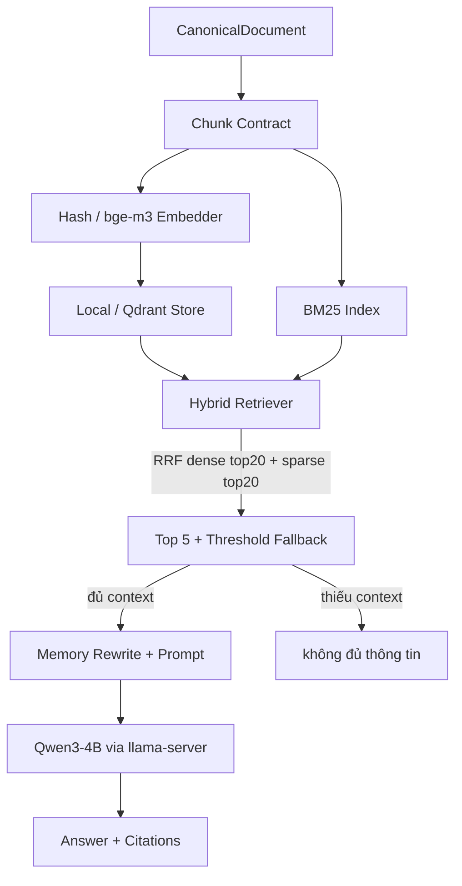

# RAG Document Parser

Pipeline Python dùng để đọc và chuẩn hóa tài liệu trước khi đưa vào hệ thống RAG. Project hỗ trợ PDF, DOCX, XLSX và ảnh PNG/JPG/JPEG; kết quả chính là JSON theo schema `CanonicalDocument`, kèm Markdown và các asset để kiểm tra.

Project gồm hai giai đoạn: (1) ingestion và parsing ra `CanonicalDocument`, (2) RAG local gồm chunking, embedding hybrid BM25 + bge-m3, lưu trữ Local/Qdrant, retrieval RRF top 5, sinh câu trả lời bằng Qwen3-4B qua llama.cpp, kèm FastAPI và Streamlit UI.

## Yêu cầu

- Python 3.10–3.13; khuyến nghị Python 3.12
- Linux hoặc môi trường có PaddlePaddle wheel tương thích
- CPU chạy được toàn bộ pipeline; không bắt buộc GPU
- Internet trong lần cài dependency và tải model đầu tiên

## Chạy nhanh

Thực hiện các lệnh sau từ thư mục gốc của project:

```bash
python3.12 -m venv .venv
source .venv/bin/activate
python -m pip install --upgrade pip
python -m pip install -r requirements.txt
python scripts/download_ocr_models.py
python scripts/parse_test_documents.py --ocr-options config/ocr_scan_vi.json
```

Trên Windows PowerShell, kích hoạt môi trường bằng:

```powershell
.venv\Scripts\Activate.ps1
```

`requirements.txt` cài project ở chế độ editable cùng các extra DOCX, OCR và test. `constraints.txt` khóa các phiên bản đã được kiểm tra trên Python 3.12/Linux CPU.

Muốn chạy thêm RAG local, API và UI, cài các extra tương ứng:

```bash
python -m pip install -e '.[rag,api]'
```

Extra `rag` gồm `numpy`, `qdrant-client` và `sentence-transformers` cho embedding bge-m3 và Qdrant. Extra `api` gồm `fastapi`, `uvicorn`, `httpx` và `streamlit` cho service và chat UI. Chạy offline hoặc test chỉ cần embedder `hash`, không bắt buộc tải model embedding.

Nếu Python trên Debian/Ubuntu không có `ensurepip`, có thể tạo môi trường bằng:

```bash
python3.12 -m venv --without-pip .venv
python -m pip --python .venv/bin/python install pip
source .venv/bin/activate
python -m pip install -r requirements.txt
```

Nếu việc cài PaddlePaddle từ PyPI gặp lỗi, cài CPU wheel trước rồi chạy lại requirements:

```bash
python -m pip install paddlepaddle==3.3.0 \
  --index-url https://www.paddlepaddle.org.cn/packages/stable/cpu/
python -m pip install -r requirements.txt
```

## Chuẩn bị dữ liệu

Đặt tài liệu cần xử lý vào thư mục `documents/`:

```text
documents/
  tai_lieu.pdf
  bao_cao.docx
  du_lieu.xlsx
  anh_scan.png
```

Các định dạng được hỗ trợ:

| Định dạng | Backend | Nội dung trích xuất |
| --- | --- | --- |
| PDF digital | PyMuPDF | Text, bảng, ảnh, font và bounding box |
| PDF scan | PaddleOCR PPStructureV3 | Layout, OCR, bounding box và ảnh trang |
| PDF hybrid | PyMuPDF | Native text và image assets |
| DOCX | Docling | Heading, đoạn văn, danh sách, bảng và ảnh |
| XLSX | openpyxl | Vùng bảng, giá trị, công thức và merged cells |
| PNG/JPG/JPEG | PaddleOCR PPStructureV3 | OCR, layout và bounding box |

## Tải model OCR

Profile tiếng Việt dùng ba nhóm model:

- Recognition tiếng Việt: `.cache/models/ppocrv6_vi/`
- Layout: `.cache/paddlex/official_models/PP-DocLayout-S/`
- Text detection: `.cache/paddlex/official_models/PP-OCRv5_mobile_det/`

Tải model recognition tiếng Việt bằng:

```bash
python scripts/download_ocr_models.py
```

Script tải bốn inference file từ model `tieubaoca/pp-ocrv6-medium-rec-vietnamese`, cố định revision và ghi checksum vào `model_manifest.json`. Model layout và detection được Paddle tải vào `.cache/paddlex/` khi OCR chạy lần đầu. Toàn bộ `.cache/` đã được loại khỏi Git.

Muốn lưu recognition model ở vị trí khác:

```bash
python scripts/download_ocr_models.py --output /duong/dan/model
```

Sau đó cập nhật `text_recognition_model_dir` trong file cấu hình OCR.

## Chạy parser

### Chạy với profile OCR tiếng Việt

Đây là lệnh khuyến nghị cho tập tài liệu có PDF scan hoặc ảnh tiếng Việt:

```bash
python scripts/parse_test_documents.py \
  --input documents \
  --output parsed_test_document \
  --ocr-options config/ocr_scan_vi.json
```

### Chạy với cấu hình mặc định

Nếu chỉ xử lý PDF digital, DOCX hoặc XLSX:

```bash
python scripts/parse_test_documents.py
```

Mặc định script đọc `documents/` và ghi vào `parsed_test_document/`. Các đường dẫn mặc định luôn được tính từ thư mục project, nên có thể gọi script từ working directory khác.

### Điều chỉnh DPI OCR

```bash
python scripts/parse_test_documents.py \
  --ocr-options config/ocr_scan_vi.json \
  --ocr-dpi 200
```

DPI mặc định là 150. Tăng DPI có thể giúp tài liệu chữ nhỏ nhưng sẽ dùng nhiều RAM và chạy lâu hơn.

### Chạy bằng Python API

```python
from pathlib import Path

from document_parser import DocumentPipeline

pipeline = DocumentPipeline()
summary = pipeline.parse_all(
    Path("documents"),
    Path("parsed_test_document"),
)
print(summary["counts"])
```

Nếu cần profile tiếng Việt qua API, đọc `config/ocr_scan_vi.json`, resolve các đường dẫn tương đối theo thư mục `config/`, rồi truyền dictionary vào `ParserConfig(ocr_options=...)`. Script CLI đã thực hiện bước resolve này tự động.

## Kết quả đầu ra

Mỗi tài liệu tạo một thư mục riêng:

```text
parsed_test_document/
  summary.json
  tai_lieu/
    document.json
    document.md
    assets/
```

- `document.json`: dữ liệu chuẩn để pipeline RAG sử dụng
- `document.md`: phiên bản dễ đọc để kiểm tra thủ công
- `assets/`: ảnh gốc, ảnh trích xuất và trang PDF được render cho OCR
- `summary.json`: trạng thái toàn batch, parser đã dùng, chất lượng và lỗi từng file/trang

Script trả exit code `0` khi tất cả file thành công và `1` khi không có input, có file lỗi hoặc có trang ở trạng thái partial. Một trang lỗi không làm dừng toàn bộ batch.

## Tạo index RAG

Sau khi có `parsed_test_document/`, tạo chunk, embedding và index hybrid bằng:

```bash
python scripts/ingest.py --input parsed_test_document --embedder hash --backend local
```

Nếu đã có chunk chuẩn từ Step 1, truyền trực tiếp để bỏ qua fallback chunker:

```bash
python scripts/ingest.py --chunks chunks.jsonl --embedder hash --backend local
```

Chạy production với embedding bge-m3 và Qdrant local:

```bash
docker compose up -d qdrant
python scripts/init_qdrant.py
python scripts/ingest.py --input parsed_test_document --embedder bge-m3 --backend qdrant
```

Chạy với Qdrant Cloud (URL và key lấy từ flag, biến môi trường hoặc file `.env`):

```bash
python scripts/init_qdrant.py --qdrant-url https://<cluster>.cloud.qdrant.io --qdrant-api-key <key>
python scripts/ingest.py --input parsed_test_document --embedder bge-m3 --backend qdrant \
  --qdrant-url https://<cluster>.cloud.qdrant.io --qdrant-api-key <key>
```

Có thể đặt `QDRANT_URL` và `QDRANT_API_KEY` trong file `.env` ở thư mục gốc (đã gitignore, xem `.env.example`); script tự đọc khi thiếu flag. `query.py`, `chat.py` và API (`QDRANT_URL`/`QDRANT_API_KEY`) dùng cùng cơ chế.

Kết quả mặc định ghi vào `.cache/rag/`:

```text
.cache/rag/
  chunks.jsonl      toàn bộ chunk theo schema Chunk
  vectors.json      id và vector dense cho backend local
  payloads.jsonl    payload Qdrant gồm doc_id, page, type, content, content_hash
  bm25.json         index lexical cho hybrid search
  manifest.json     counts, embedder, backend và collection
```

Chunk tuân thủ contract `text`/`table`/`figure`: text gom theo heading khoảng 2000 ký tự với overlap 200 ký tự, mỗi bảng là một chunk kèm tiêu đề section, mỗi ảnh là một chunk figure giữ `image_path`. Mỗi chunk có `content_hash` nên ingest lại an toàn, chunk trùng bị bỏ qua. Toàn bộ `.cache/` đã được loại khỏi Git.

## Truy vấn RAG

Truy vấn hybrid dense + BM25 với RRF, mặc định trả top 5:

```bash
python scripts/query.py --rag-dir .cache/rag --query "Phí thường niên thẻ chuẩn là bao nhiêu?"
```

Lọc theo loại chunk, chỉnh top K và ngưỡng fallback:

```bash
python scripts/query.py --rag-dir .cache/rag --query "..." --filter-type table --top-k 5 --threshold 0.02 --as-json
```

Threshold chưa có giá trị cố định; tune trên `eval/questions.json` trước khi chốt. Nếu best fused score dưới threshold hoặc query rỗng, pipeline trả fallback `không đủ thông tin` và không gọi LLM. Có thể bật rerank cross-encoder:

```bash
python scripts/query.py --rag-dir .cache/rag --query "..." --rerank
```

Rerank dùng `BAAI/bge-reranker-v2-m3` trên CPU, mặc định tắt vì nặng trên máy 13GB RAM.

## Chat và sinh câu trả lời

Chat một câu hỏi:

```bash
python scripts/chat.py --rag-dir .cache/rag --query "Phí thường niên thẻ chuẩn?"
```

Chat tương tác:

```bash
python scripts/chat.py --rag-dir .cache/rag
```

Chat với LLM production qua llama-server:

```bash
llama-server -hf unsloth/Qwen3-4B-Instruct-2507-GGUF:Q4_K_M --port 8080
python scripts/chat.py --rag-dir .cache/rag --llm server --query "..."
```

Luồng trả lời là guardrail-in → rewrite câu nối tiếp bằng memory → hybrid retrieve → fallback nếu thiếu context → build prompt top 5 đoạn đánh số `[S1]...[S5]` kèm lịch sử và summary → LLM Qwen3-4B nhiệt độ 0.15 → guardrail-out → đáp án kèm trích dẫn `[file_name, trang N]`. Không chạy VLM và LLM chat cùng lúc trên máy 16GB RAM.

## Chạy API và UI

Khởi động FastAPI từ thư mục gốc:

```bash
uvicorn api.main:app --host 0.0.0.0 --port 8000
```

Cấu hình qua biến môi trường:

```bash
RAG_DIR=.cache/rag RAG_BACKEND=local RAG_EMBEDDER=hash \
LLM_BACKEND=fake LLM_BASE_URL=http://localhost:8080/v1 \
uvicorn api.main:app --host 0.0.0.0 --port 8000
```

Các endpoint:

| Endpoint | Phương thức | Nội dung trả về |
| --- | --- | --- |
| `/health` | GET | `status`, `rag_loaded`, `llm_backend` |
| `/stats` | GET | `points`, `bm25_docs` |
| `/query` | POST | `answer`, `citations`, `fallback`, `standalone_question`, `chunks` |

Ví dụ gọi query:

```bash
curl -X POST http://localhost:8000/query \
  -H 'Content-Type: application/json' \
  -d '{"question": "Phí thường niên thẻ chuẩn là bao nhiêu?", "session_id": "demo"}'
```

Chạy Streamlit UI sau khi API đã sẵn sàng:

```bash
streamlit run ui/app.py
```

Mặc định UI gọi `http://localhost:8000`; đổi bằng biến `RAG_API_URL`. UI giữ `session_id` riêng cho memory hội thoại, hiển thị trạng thái RAG và nút tạo session mới.

## Chạy test

Chạy toàn bộ test:

```bash
python -m pytest -q
```

Tách test nhanh và integration test:

```bash
python -m pytest -q -m 'not integration'
python -m pytest -q -m integration
```

Các test thông thường không yêu cầu GPU hoặc model OCR thật; OCR backend được giả lập ở những test phù hợp. Test RAG (`test_embed_store`, `test_retrieve`, `test_generate`) dùng embedder `hash` và `FakeLLM` nên chạy offline, tổng 15 test.

## Cấu hình OCR

Profile `config/ocr_scan_vi.json` dành cho tài liệu scan tiếng Việt dạng văn bản trên CPU. Profile sử dụng:

- `PP-DocLayout-S` cho layout
- `PP-OCRv5_mobile_det` cho text detection
- `PP-OCRv6_medium_rec` với model tiếng Việt cho recognition
- Tắt orientation, unwarping, region detection, table recognition và formula recognition

Table recognition bị tắt vì profile này ưu tiên scan văn bản. Việc trích xuất bảng native từ PDF digital và XLSX vẫn hoạt động. Nếu tài liệu scan có bảng, tạo một file JSON khác và bật `use_table_recognition`.

Ví dụ cấu hình OCR tối giản:

```json
{
  "device": "cpu",
  "cpu_threads": 4,
  "enable_mkldnn": false,
  "use_doc_orientation_classify": false,
  "use_doc_unwarping": false,
  "use_textline_orientation": false,
  "use_formula_recognition": false
}
```

Chạy bằng file cấu hình riêng:

```bash
python scripts/parse_test_documents.py --ocr-options ocr_options.json
```

## Cấu hình RAG

Hai file JSON điều khiển index và sinh câu trả lời:

| File | Nội dung chính |
| --- | --- |
| `config/rag_store.json` | `collection`, `vector_size` 1024, `distance` Cosine, `embedder` bge-m3, `bm25` k1/b, `qdrant_url` |
| `config/rag_generate.json` | `llm` model Qwen3-4B Q4_K_M qua `base_url`, `temperature` 0.15, `memory` max turns/chars, `prompt` top_k và ngôn ngữ, `api` host/port |

Ví dụ cấu hình store tối giản:

```json
{
  "collection": "docs",
  "vector_size": 1024,
  "distance": "Cosine",
  "embedder": "BAAI/bge-m3",
  "qdrant_url": "http://localhost:6333"
}
```

Ví dụ cấu hình generate tối giản:

```json
{
  "llm": {
    "backend": "server",
    "model": "unsloth/Qwen3-4B-Instruct-2507-GGUF:Q4_K_M",
    "base_url": "http://localhost:8080/v1",
    "temperature": 0.15,
    "max_tokens": 512
  }
}
```

Bộ câu hỏi tune ngưỡng retrieval nằm trong `eval/questions.json`, mỗi item gồm `q`, `expect_contains`, `expect_type` và cờ `expect_fallback` cho câu ngoài tài liệu.

## Luồng xử lý



PDF được phân loại theo từng trang. Pipeline ưu tiên native extraction khi text đủ tốt và chỉ fallback sang OCR cho trang scan hoặc trang không đạt quality check. OCR thay thế text native trên trang fallback để tránh dữ liệu trùng.

Luồng RAG local sau parsing:



Retrieval fuse hai danh sách dense và BM25 bằng RRF, giữ top 5, hỗ trợ lọc `doc_id`/`type` và hook rerank `bge-reranker-v2-m3`. Memory giữ tối đa 6 turn và 6000 ký tự mỗi session, tự rewrite câu nối tiếp thành câu độc lập trước retrieval.

## Cấu trúc project

```text
config/
  ocr_scan_vi.json          Profile OCR tiếng Việt
  rag_store.json            Collection, embedder bge-m3, BM25 và Qdrant URL
  rag_generate.json         LLM Qwen3-4B, memory, prompt và API host/port
documents/                  Tài liệu đầu vào mặc định
eval/
  questions.json            Bộ câu hỏi tune ngưỡng retrieval
scripts/
  download_ocr_models.py    Tải model recognition tiếng Việt
  parse_test_documents.py   CLI chạy parser theo batch
  ingest.py                 Chunk + embed + index vào Local/Qdrant
  init_qdrant.py            Tạo collection Qdrant docs
  query.py                  CLI hybrid retrieve top 5
  chat.py                   CLI rewrite → retrieve → LLM answer
src/document_parser/
  loader/                   Đọc và kiểm tra file
  router/                   Chọn parser, phân loại trang PDF
  parsers/                  PDF, DOCX, XLSX và image adapters
  normalization/            Canonical schema và normalizer
  quality/                  Kiểm tra chất lượng extraction
  utils/                    Serialization và file utilities
src/rag/
  schemas.py                Schema Chunk text/table/figure
  chunk_contract.py         Fallback chunker chờ Step 1 hoàn thiện
  embeddings.py             Hash embedder offline và bge-m3 CPU
  bm25.py                   Index lexical tiếng Việt
  store.py                  LocalVectorStore và QdrantStore
  retrieve.py               Hybrid RRF, threshold fallback và rerank hook
  llm.py                    FakeLLM test và client llama-server
  memory.py                 Session memory, rewrite và summary
  guardrails.py             Kiểm tra input/output
  answer.py                 Build prompt, citations và fallback
src/api/main.py             FastAPI /health, /stats và /query
ui/app.py                   Streamlit chat UI gọi API
docker-compose.yml          Service Qdrant local
tests/                      Unit và integration tests
```

## Lỗi thường gặp

**`Cannot initialize PPStructureV3`**

Kiểm tra môi trường đã được activate và chạy lại:

```bash
python -m pip install -r requirements.txt
python scripts/download_ocr_models.py
```

**Không tìm thấy model tiếng Việt**

Kiểm tra file sau tồn tại:

```bash
ls .cache/models/ppocrv6_vi/inference.pdiparams
```

Sau đó chạy parser với `--ocr-options config/ocr_scan_vi.json`.

**Paddle báo lỗi OneDNN/PIR trên CPU**

Profile mặc định đã tắt MKLDNN cho pipeline. Nếu lỗi xuất hiện trong recognition model, bỏ phần `engine_config` của `TextRecognition` trong `config/ocr_pp_structure_vi.yaml` để dùng CPU backend thông thường.

**Script kết thúc với exit code 1**

Mở `parsed_test_document/summary.json` để xem `failed`, `partial`, `failed_pages` và thông báo lỗi tương ứng.

**`BM25 index not found` khi query/chat/API**

Chạy ingest trước để tạo `.cache/rag/`:

```bash
python scripts/ingest.py --input parsed_test_document --embedder hash --backend local
```

**Qdrant không kết nối được**

Kiểm tra container và tạo lại collection:

```bash
docker compose ps
python scripts/init_qdrant.py
```

Muốn chạy không cần server, dùng `--backend local` hoặc `--backend qdrant-memory`.

**API trả `503 RAG index not loaded`**

Kiểm tra biến `RAG_DIR` trỏ đúng thư mục chứa `bm25.json`, `vectors.json` và `payloads.jsonl`. Kiểm tra `/health` để xem `rag_loaded` và `error`.

**LLM server unreachable**

Khởi động llama-server trước khi dùng `--llm server`, hoặc giữ `--llm fake` để test offline. Không chạy VLM và LLM chat cùng lúc trên máy 16GB RAM.

## Giới hạn hiện tại

- Reading order và heading của PDF digital dựa trên heuristic, có thể sai ở layout nhiều cột.
- PDF hybrid chưa OCR chọn lọc từng vùng ảnh.
- DOCX thường không có page number hoặc bounding box thật.
- openpyxl không tự tính lại công thức Excel.
- OCR tiếng Việt vẫn có thể sai dấu, số, ký tự và thứ tự đọc.
- Quality check đánh giá cấu trúc và chất lượng text cơ bản, chưa đo CER/WER.
- Chunker RAG hiện là fallback tạm thời, chờ bản heading-aware đầy đủ của Step 1.
- Embedder `hash` chỉ dùng cho test offline; production cần bge-m3 và tải model lần đầu.
- Threshold fallback chưa chốt, cần tune trên `eval/questions.json`.
- Rerank cross-encoder mặc định tắt vì nặng CPU.

Kết quả kiểm thử trên bộ tài liệu mẫu nằm trong `PARSE_REPORT.md`.
