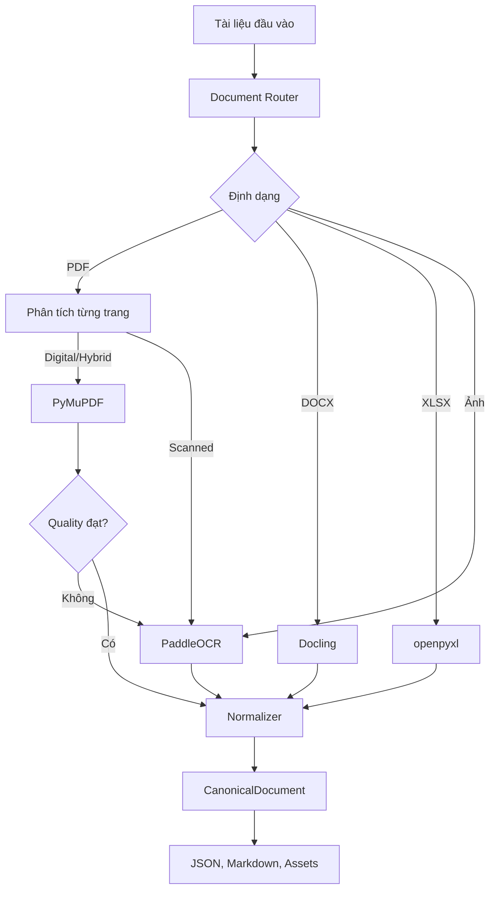
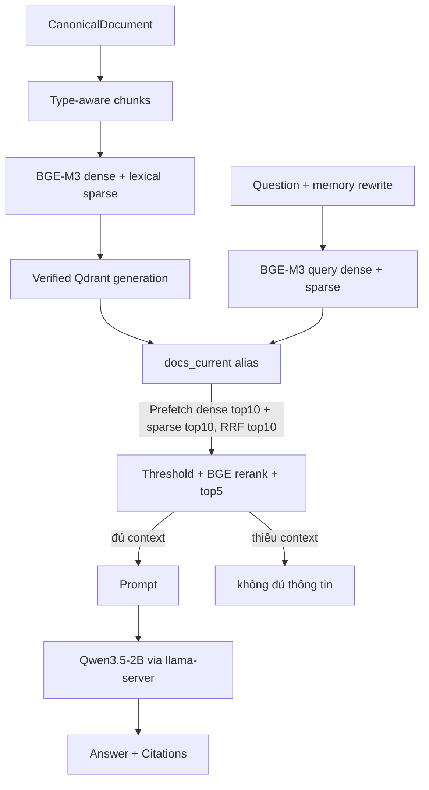

# RAG Document Parser

Pipeline Python dùng để đọc tài liệu `PDF`, `DOCX`, `XLSX` và ảnh, sau đó chuẩn hóa nội dung và xuất ra JSON, Markdown cùng các asset liên quan.

Project gồm hai giai đoạn: (1) ingestion và parsing ra `CanonicalDocument`, (2) RAG gồm chunking, embedding BGE-M3 dense + lexical sparse, lưu trữ Qdrant, hybrid search bằng Qdrant Query API và RRF, sinh câu trả lời bằng Qwen3.5-2B qua llama.cpp, kèm FastAPI và Streamlit UI.

Để mở lại hệ thống hỏi đáp đã có dữ liệu, xem [Khởi động hệ thống](#khởi-động-hệ-thống).

## Production ingestion pipeline

Pipeline mới giữ nguyên `document.json` và asset do parser tạo. Mọi caption và
dữ liệu retrieval dẫn xuất được ghi vào thư mục output riêng:

```text
CanonicalDocument + assets
  -> image context (BAAI/bge-m3 tokenizer, revision pinned, <= 200 tokens)
  -> Gemini VLM structured caption
  -> derived retrieval documents
  -> text/table/figure chunks (hard maximum 768 tokens)
  -> BGE-M3 dense 1024 + lexical sparse
  -> Qdrant generation collection
  -> dense/sparse/hybrid verification
  -> docs_current alias
```

Cấu hình mặc định và revision được khóa tại
[`config.yaml`](config.yaml). Gap analysis và thứ tự
triển khai nằm tại
[`docs/INGESTION_IMPLEMENTATION_PLAN.md`](docs/INGESTION_IMPLEMENTATION_PLAN.md).

### Image context và caption

Mỗi image dùng tối đa đúng 200 token văn bản hợp lệ gần nhất theo canonical
reading order: 100 token trước và 100 token sau. Phần quota thiếu được chuyển
sang phía còn lại. Context có provenance đến element/page/section, tokenizer
fingerprint và deterministic hash. Header/footer, nội dung bị exclude, OCR debug,
placeholder và caption AI cũ không được dùng.

Tạo context report mà không gửi dữ liệu ra ngoài:

```bash
python scripts/caption_images.py \
  --input parsed_test_document/all_documents_gpu \
  --output artifacts/ingestion/caption-dry-run \
  --dry-run
```

Captioning gọi trực tiếp Gemini Developer API, mỗi request chứa đúng một image.
API key và model chỉ được đọc từ biến môi trường. Rate limiter giữ tối thiểu 4
giây giữa thời điểm bắt đầu hai request liên tiếp, kể cả retry và preflight:

```bash
export GEMINI_API_KEY='...'
export GEMINI_MODEL='gemini-3.5-flash-lite'
```

Trước batch, chạy preflight thật bằng ảnh tổng hợp để xác nhận model và request
format hiện tại có hỗ trợ vision:

```bash
python scripts/caption_images.py \
  --output artifacts/ingestion/preflight \
  --preflight-only
```

Document image và context chỉ được gửi khi người vận hành cấp acknowledgement
rõ ràng. Giá trị này nên được ghi trong audit log của run, không đặt trong `.env`:

```bash
python scripts/caption_images.py \
  --input parsed_test_document/all_documents_gpu \
  --output artifacts/ingestion/caption-pilot-v1 \
  --pilot 10 \
  --authorize-external-egress I_AUTHORIZE_DOCUMENT_EGRESS
```

Output gồm `preflight.json`, `image_context_debug.jsonl`, `captions.jsonl`, cache
checkpoint và `pilot_report.json`. Pilot report để trạng thái visual review là
`pending`; người review phải kiểm tra correctness, nhánh bị bỏ sót, số liệu hallucinate
và reading order. Batch đầy đủ bỏ `--pilot`. Mọi image discoverable đều có disposition
`pending`, `completed`, `needs_review`, `excluded` hoặc `error`, nên có thể resume.

### Prepare và full ingest

Khi truyền `--captions`, pipeline ghép caption vào đúng image element của tài liệu
retrieval và chunk chung với văn bản xung quanh. File caption phải hoàn tất, không còn bản ghi `pending`
hoặc `error`. Mỗi chunk có trường `image`: danh sách chứa ID ảnh, đường dẫn asset,
hash, trang, caption, văn bản nhìn thấy và các chi tiết chưa chắc chắn. Chunk không
chứa ảnh có `image: []`. Trường này được giữ trong JSON và payload Qdrant để dùng
khi truy xuất. Tài liệu retrieval đã ghép caption nằm trong thư mục `retrieval/`
của run.

Chunker `type-aware-v2` chỉ thêm heading một lần, ưu tiên ranh giới đoạn/câu và
không tạo chunk chỉ chứa overlap. Caption gồm cả `steps`, `relationships` và
`chart_details`; caption vừa hard limit được giữ nguyên trong một chunk. Nếu
caption quá dài, các phần giữ tiêu đề và được đánh dấu bằng
`metadata.split_image_captions`, còn trường `image` vẫn giữ caption đầy đủ.
Ngân sách 768 token bao gồm heading và special tokens của tokenizer BGE-M3;
embedder từ chối đầu vào quá giới hạn thay vì âm thầm truncate.

Chuẩn bị retrieval/chunk mà chưa embedding hoặc ghi Qdrant:

```bash
python scripts/ingest.py \
  --input parsed_test_document/all_documents_gpu \
  --captions artifacts/ingestion/caption-v1/captions.jsonl \
  --output artifacts/ingestion \
  --run-id prepare-v1 \
  --mode prepare-only
```

Full production ingest tạo collection generation mới. Nếu count hoặc smoke query
dense/sparse/hybrid thất bại, script trả exit code 1 và không đổi alias:

```bash
export QDRANT_URL='http://localhost:6333'
python scripts/ingest.py \
  --input parsed_test_document/all_documents_gpu \
  --captions artifacts/ingestion/caption-v1/captions.jsonl \
  --output artifacts/ingestion \
  --run-id ingest-v1 \
  --mode full-ingest \
  --embedder bge-m3 \
  --backend qdrant
```

`--backend local --embedder hash` dành cho unit test/offline development và phải
được chọn rõ ràng. Production không tự fallback khỏi Qdrant. Mỗi run ghi derived
retrieval JSON, `chunks.jsonl`, embedding fingerprint, manifest và verification
report. Collection generation cũ được giữ để rollback; chỉ alias `docs_current`
được chuyển atomically sau verification.

Có thể verify lại generation và tùy chọn publish:

```bash
python scripts/verify_index.py \
  --collection docs_20261008T120000Z \
  --expected-points 649 \
  --output artifacts/ingestion/verify-v1.json \
  --publish
```

Các test external thật không chạy mặc định vì cần model download, OpenCode key,
quyền data egress và Qdrant server. Unit test dùng fake VLM/embedding/store:

```bash
pytest -q tests/test_image_context.py tests/test_captioning.py \
  tests/test_type_aware_chunking.py tests/test_bge_m3_hybrid.py \
  tests/test_index_publication.py
```

### Xuất PDF thành Markdown bằng Gemini

Script này upload một PDF lên Gemini Files API, yêu cầu model trong `GEMINI_MODEL`
trích xuất toàn bộ văn bản thành Markdown, rồi lưu cạnh PDF với phần mở rộng `.md`:

```bash
python scripts/pdf_to_markdown_gemini.py documents/van-ban.pdf
```

Script đọc `GEMINI_API_KEY` và `GEMINI_MODEL` từ environment hoặc `.env` ở thư mục
gốc project. Có thể chỉ định output và cho phép ghi đè rõ ràng:

```bash
python scripts/pdf_to_markdown_gemini.py documents/van-ban.pdf \
  --output output/van-ban.md \
  --force
```

Mọi request tới Gemini cách nhau tối thiểu 4 giây. Nếu phản hồi chạm giới hạn
output, script báo lỗi thay vì lưu bản Markdown bị cắt; có thể tăng giới hạn bằng
`--max-output-tokens`. PDF được gửi tới Google Gemini để xử lý.
Nếu Gemini kết thúc với `RECITATION`, model đã nhận file nhưng chặn trả lại văn
bản nguyên văn; đây không phải lỗi API key hoặc kết nối. Dùng parser PDF/OCR
local của project để xuất toàn văn trong trường hợp đó.


## Yêu cầu

- Python `3.11` đến `3.13` (khuyến nghị `3.12`)
- Internet ở lần cài dependency và tải model đầu tiên
- Chọn **một** backend Paddle: CPU hoặc GPU

Các lệnh bên dưới được chạy tại thư mục gốc của project (`ragminiprj`).

## Chạy nhanh bằng CPU

```bash
python3.12 -m venv .venv
source .venv/bin/activate

python -m pip install --upgrade pip
python -m pip install -e '.[cpu]'
python scripts/download_ocr_models.py

python scripts/parse_test_documents.py \
  --device cpu \
  --input documents \
  --output parsed_test_document/cpu
```

Trên Windows PowerShell, kích hoạt môi trường bằng:

```powershell
.venv\Scripts\Activate.ps1
```

## Chạy bằng GPU
`requirements.txt` khai báo dependency chung và được `pyproject.toml` đọc khi build package.
Cài project ở chế độ editable bằng `pip install -e`; chọn đúng một extra `cpu`
hoặc `gpu` để cài backend Paddle tương ứng.

Muốn chạy thêm RAG local, API và UI, cài các extra tương ứng:

```bash
python -m pip install -e '.[rag,api]'
```

Extra `rag` gồm `numpy`, `qdrant-client` và `FlagEmbedding` cho embedding BGE-M3 dense/sparse và Qdrant. Extra `api` gồm `fastapi`, `uvicorn`, `httpx` và `streamlit` cho service và chat UI. Chạy offline hoặc test chỉ cần embedder `hash`, không bắt buộc tải model embedding.

Nếu Python trên Debian/Ubuntu không có `ensurepip`, có thể tạo môi trường bằng:

Tạo một virtual environment riêng và cài bản `paddlepaddle-gpu` phù hợp với CUDA/driver của máy. Ví dụ với CUDA 11.8:

```bash
python3.12 -m venv .venv-gpu
source .venv-gpu/bin/activate

python -m pip install --upgrade pip
python -m pip install paddlepaddle-gpu==3.3.0 \
  --index-url https://www.paddlepaddle.org.cn/packages/stable/cu118/
python -m pip install -e '.[gpu]'
python scripts/download_ocr_models.py

python scripts/check_gpu.py
python scripts/parse_test_documents.py \
  --device gpu \
  --input documents \
  --output parsed_test_document/gpu
```

Nếu dùng phiên bản CUDA khác, chọn wheel Paddle tương ứng theo [hướng dẫn cài đặt PaddlePaddle](https://www.paddlepaddle.org.cn/documentation/docs/en/install/index_en.html). Parser sẽ báo lỗi nếu GPU không khả dụng, không tự động chuyển sang CPU.

## Cấu hình

File cấu hình mặc định nằm tại [`config.yaml`](config.yaml). Các mục thường cần chỉnh:

```yaml
device: gpu:0 # cpu, gpu hoặc gpu:N

paths:
  input: documents
  output: parsed_test_document/results

ocr:
  dpi: 150
```

Có thể không sửa file cấu hình mà ghi đè trực tiếp khi chạy:

```bash
python scripts/parse_test_documents.py \
  --device cpu \
  --input /path/to/documents \
  --output /path/to/results
```

Hoặc dùng một file YAML riêng:

```bash
python scripts/parse_test_documents.py --config /path/to/config.yaml
```

Các tùy chọn CLI chính:

```text
--device cpu|gpu|gpu:N
--input PATH
--output PATH
--config PATH
--layout-model MODEL
--detection-model MODEL
--recognition-model MODEL
--corrector protonx|protonx_legal|bmd1905|bravend
```

Thư mục output phải nằm ngoài thư mục input. Lệnh trả exit code `1` nếu không tìm thấy tài liệu hỗ trợ, có file lỗi hoặc có tài liệu chỉ được xử lý một phần.

## Kết quả

Mỗi tài liệu được ghi vào một thư mục riêng:

```text
parsed_test_document/
  summary.json
  ten_tai_lieu/
    document.json
    document.md
    assets/
```

- `summary.json`: tổng hợp trạng thái của cả batch và lỗi theo file
- `document.json`: nội dung chuẩn hóa, metadata, quality và thông tin OCR
- `document.md`: bản dễ đọc để kiểm tra kết quả
- `assets/`: ảnh gốc, ảnh trích xuất hoặc trang PDF đã render
- `document.json`: dữ liệu chuẩn để pipeline RAG sử dụng
- `document.md`: phiên bản dễ đọc để kiểm tra thủ công
- `assets/`: ảnh gốc, ảnh trích xuất và trang PDF được render cho OCR
- `summary.json`: trạng thái toàn batch, parser đã dùng, chất lượng và lỗi từng file/trang

Script trả exit code `0` khi tất cả file thành công và `1` khi không có input, có file lỗi hoặc có trang ở trạng thái partial. Một trang lỗi không làm dừng toàn bộ batch.

## Tạo index RAG

Sau khi có canonical documents, tạo generation Qdrant mới và publish alias
`docs_current` sau verification:

```bash
python scripts/ingest.py --input parsed_test_document/all_documents_gpu \
  --output artifacts/ingestion --run-id production-v1
```

Nếu đã có chunks theo schema `Chunk`, truyền trực tiếp:

```bash
python scripts/ingest.py --chunks chunks.jsonl --run-id production-v1
```

Qdrant phải chạy trước khi full ingest. `docker-compose.yml` hiện bật TLS và
yêu cầu `tls/cert.pem`, `tls/key.pem` cùng `QDRANT__SERVICE__API_KEY`. Đặt
`QDRANT_URL` dùng HTTPS và certificate được client tin cậy. Có thể dùng một
Qdrant local không TLS riêng với `QDRANT_URL=http://localhost:6333`.

```bash
docker compose up -d qdrant
```

Chạy với Qdrant Cloud (URL và key lấy từ flag, biến môi trường hoặc file `.env`):

```bash
python scripts/ingest.py --input parsed_test_document/all_documents_gpu --run-id production-v1 \
  --qdrant-url https://<cluster>.cloud.qdrant.io --qdrant-api-key <key>
```

Có thể đặt `QDRANT_URL` và `QDRANT_API_KEY` trong file `.env` ở thư mục gốc (đã gitignore, xem `.env.example`); script tự đọc khi thiếu flag. `query.py`, `chat.py` và API (`QDRANT_URL`/`QDRANT_API_KEY`) dùng cùng cơ chế.

Artifacts mặc định nằm trong `artifacts/ingestion/` (hoặc subdirectory `--run-id`):

```text
artifacts/ingestion/production-v1/
  chunks.jsonl      toàn bộ chunk theo schema Chunk
  embedding_fingerprint.json
  verification_report.json
  manifest.json     counts, embedder, backend và collection
```

Production query chỉ cần Qdrant và embedding model; không đọc `bm25.json`,
`chunks.jsonl` hay vectors từ thư mục artifacts. Backend `local` dành cho test
offline vẫn có thể được chọn rõ ràng:

```bash
python scripts/ingest.py --input parsed_test_document/all_documents_gpu \
  --output .cache/rag --embedder hash --backend local
python scripts/query.py --rag-dir .cache/rag --embedder hash --backend local --query "..."
```

## Truy vấn RAG

Mặc định encode câu hỏi bằng BGE-M3 dense + lexical sparse, gọi Qdrant Query API
với prefetch top 10 mỗi nhánh và RRF, lấy tối đa 10 candidate từ alias `docs_current`,
lọc cosine relevance, rồi rerank bằng `BAAI/bge-reranker-v2-m3` để trả top 5:

```bash
python scripts/query.py --query "Phí thường niên thẻ chuẩn là bao nhiêu?"
```

Lọc theo loại chunk, chỉnh top K và ngưỡng fallback:

```bash
python scripts/query.py --query "..." --filter-type table --top-k 5 --as-json
```

Filter được áp dụng trong cả hai prefetch trước khi giới hạn số kết quả.
Đổi generation/alias bằng `--collection`. RRF chỉ dùng để xếp hạng. Relevance
gate dùng cosine giữa query dense vector và dense vector của mỗi candidate,
được trả về trong cùng request Qdrant. Chỉ chunk đạt ngưỡng mới được đưa vào
reranker và prompt. `--threshold` hiện mang nghĩa **dense cosine**, không dùng
lại ngưỡng RRF cũ.

Đo ngưỡng bằng bộ câu hỏi có cả câu được tài liệu hỗ trợ và câu ngoài tài liệu:

```bash
python scripts/eval_retrieval.py --questions eval/questions.json \
  --calibrate-output artifacts/relevance-calibration.json --as-json
```

Dataset phải khớp với corpus đã ingest; mỗi câu được hỗ trợ cần `expect_contains`.
Lệnh chỉ ghi threshold khi có nguồn đúng cho câu positive và có ngưỡng phân tách
được positive/negative; nếu không, lệnh trả exit code 1. Đây là calibration trên
training set, cần kiểm tra lại bằng bộ câu hỏi độc lập trước khi triển khai.

Export `RAG_RELEVANCE_THRESHOLD` bằng giá trị `threshold` trong report cho
query/chat/API; CLI cũng nhận `--threshold`. Đo lại khi thay corpus hoặc embedding.
Request có thể tăng ngưỡng nhưng không hạ ngưỡng đã cấu hình. Nếu chưa cấu hình
threshold, không có evidence hợp lệ hoặc không chunk nào đạt ngưỡng, pipeline
trả `không đủ thông tin` và không gọi LLM. Follow-up dùng rewrite deterministic
trước retrieval nên câu bị từ chối cũng không gọi rewrite LLM. `/health` báo
`needs-calibration` khi index đã load nhưng thiếu threshold.

Rerank bật mặc định cho query/chat/API. Có thể tắt rõ ràng khi cần đối chiếu kết quả:

```bash
python scripts/query.py --query "..." --no-rerank
```

Reranker chạy trên CPU, nạp model một lần rồi dùng lại; batch size 2, chiều dài
đầu vào tối đa 1024 token. Chỉnh `retrieval.candidate_top`, `top_k`, `rerank`,
`reranker_model`, `reranker_device`, `reranker_batch_size`, `reranker_max_length`
và `reranker_cache_dir` trong `config.yaml`. Nếu ít hơn 5 đoạn đạt ngưỡng liên quan,
chỉ dùng các đoạn đủ điều kiện. Điểm rerank được trả riêng ở `chunks[].rerank_score`.

## Chat và sinh câu trả lời

Chat một câu hỏi:

```bash
python scripts/chat.py --query "Phí thường niên thẻ chuẩn?"
```

Chat tương tác:

```bash
python scripts/chat.py
```

Chat với LLM production qua llama-server:

```bash
llama-server -hf unsloth/Qwen3.5-2B-GGUF:Q4_K_M --no-mmproj --reasoning off --ctx-size 8192 --port 8080
python scripts/chat.py --query "..." --rerank
```

Luồng trả lời là guardrail-in → rewrite câu nối tiếp bằng memory → hybrid retrieve → fallback nếu thiếu context → build prompt top 5 đoạn đánh số `[S1]...[S5]` kèm lịch sử và summary → LLM Qwen3.5-2B nhiệt độ 0.15 → guardrail-out → đáp án kèm trích dẫn `[file_name, trang N]`. Không chạy VLM và LLM chat cùng lúc trên máy 16GB RAM.

## Khởi động hệ thống

Hướng dẫn dưới đây dùng Bash trên Linux và cấu hình đã chạy thành công: Qwen3.5-2B
**Q4_K_M**, llama.cpp trên CPU, BGE-M3, Qdrant, FastAPI và Streamlit. Chạy mọi lệnh
từ thư mục gốc project. Nếu kho Qdrant đã có dữ liệu, mỗi lần mở lại chỉ cần chạy
model → API → UI; không cần parse, caption hoặc ingest lại tài liệu.

### 1. Chuẩn bị môi trường và kiểm tra Qdrant

Kích hoạt môi trường đã cài project theo mục [Chạy nhanh bằng CPU](#chạy-nhanh-bằng-cpu)
hoặc [Chạy bằng GPU](#chạy-bằng-gpu):

```bash
cd /home/nghia/ai/tp/TPragsystem
source .venv/bin/activate
```

Nếu môi trường chưa có các thư viện phục vụ API và UI, cài một lần:

```bash
python -m pip install -e '.[rag,api]'
```

Giữ thiết lập runtime trong `config.yaml`, thông tin kết nối riêng trong `.env`.
Với Qdrant Cloud, `.env` ở thư mục gốc cần có:

```dotenv
QDRANT_URL=https://<cluster-id>.<region>.cloud.qdrant.io
QDRANT_API_KEY=<api-key>
```

File `.env` hiện tại cũng có thể dùng `CLUSTER_URL` thay cho `QDRANT_URL`;
project tự đọc cả hai cách đặt tên. Biến môi trường đã export có ưu tiên cao hơn
`.env`. Dùng Qdrant Cloud thì không cần khởi động Docker. Nếu dùng Qdrant local,
khởi động dịch vụ theo mục [Tạo index RAG](#tạo-index-rag), với URL/TLS và API key
tương ứng. Không ghi đè `.env` đang có bằng file mẫu.

Kiểm tra alias và số đoạn tài liệu, không in API key:

```bash
python - <<'PY'
from qdrant_client import QdrantClient
from project_settings import setting
from rag.store import resolve_qdrant_settings

url, api_key = resolve_qdrant_settings()
client = QdrantClient(url=url, api_key=api_key, timeout=15)
alias = setting("qdrant.alias", "QDRANT_COLLECTION")
print(client.get_aliases())
print(f"{alias}: {client.count(alias).count} đoạn tài liệu")
client.close()
PY
```

Kho demo hiện có **618 đoạn** qua alias `docs_current`. Nếu alias chưa tồn tại,
hoàn tất ingest và publish trước khi chạy API.

### 2. Chạy model Qwen — terminal 1

Tải đúng file GGUF vào cache project và lưu đường dẫn vào biến shell. Lệnh này
dùng lại file đã tải xong ở các lần sau; lần đầu cần kết nối Hugging Face và khoảng
1,3 GB dung lượng cho model:

```bash
export QWEN_MODEL_PATH="$(HF_HUB_DISABLE_XET=1 python -c 'from huggingface_hub import hf_hub_download; print(hf_hub_download("unsloth/Qwen3.5-2B-GGUF", "Qwen3.5-2B-Q4_K_M.gguf", cache_dir=".cache/huggingface/hub"))')"
test -f "$QWEN_MODEL_PATH"
```

Máy hiện tại đã có launcher llama.cpp tại `~/.local/bin/llama`:

```bash
~/.local/bin/llama serve \
  --model "$QWEN_MODEL_PATH" \
  --alias 'unsloth/Qwen3.5-2B-GGUF:Q4_K_M' \
  --no-mmproj --reasoning off \
  --ctx-size 8192 --parallel 1 --threads 4 --gpu-layers 0 \
  --host 127.0.0.1 --port 8080
```

Nếu máy dùng binary `llama-server`, thay `~/.local/bin/llama serve` bằng
`llama-server`, giữ nguyên các tham số. `--gpu-layers 0` chạy model trên CPU;
`--no-mmproj` bỏ phần xử lý ảnh, `--reasoning off` tắt thinking cho chat tài liệu.
Chờ log `model loaded` và `listening on http://127.0.0.1:8080`.

### 3. Chạy API — terminal 2

Mở terminal mới, vào thư mục project và kích hoạt `.venv` như bước 1:

```bash
OMP_NUM_THREADS=4 MKL_NUM_THREADS=4 TOKENIZERS_PARALLELISM=false \
  python -u scripts/serve_api.py
```

API lấy host/port từ `config.yaml`, mặc định là `0.0.0.0:8000`. BGE-M3 được nạp
khi hỏi câu đầu tiên; nếu máy chưa có cache model, lần này cần mạng và thêm dung
lượng lưu trữ. Reranker cũng cần cache riêng; tải trước một lần để tránh phải
chờ tải model khi gửi câu đầu tiên:

```bash
HF_HUB_DISABLE_XET=1 python - <<'PY'
from huggingface_hub import snapshot_download
snapshot_download(
    "BAAI/bge-reranker-v2-m3", cache_dir=".cache/huggingface/hub",
    allow_patterns=["config.json", "model.safetensors", "tokenizer.json",
                    "tokenizer_config.json", "special_tokens_map.json", "sentencepiece.bpe.model"],
)
PY
```

Chạy lệnh tải trước khi mở API hoặc ở một terminal chuẩn bị riêng. Khi BGE-M3 và
reranker đã có đủ trong các thư mục cache tương ứng, có thể thêm
`HF_HUB_OFFLINE=1 TRANSFORMERS_OFFLINE=1` trước lệnh để dùng cache hoàn toàn.

### 4. Kiểm tra và mở giao diện — terminal 3

Vào thư mục project và kích hoạt `.venv`, rồi kiểm tra:

```bash
curl --fail --silent --show-error http://localhost:8080/health
curl --fail --silent --show-error http://localhost:8080/v1/models
curl --fail --silent --show-error http://localhost:8000/health
curl --fail --silent --show-error http://localhost:8000/stats
```

Model phải trả `status: ok`; `/v1/models` phải có
`unsloth/Qwen3.5-2B-GGUF:Q4_K_M`. API phải có `status: ok`, `rag_loaded: true`,
`error: null`; `/stats` phải trỏ tới `docs_current` và có dữ liệu.
`/health` của API kiểm tra RAG nhưng không gọi thử LLM, nên cần kiểm tra cả cổng 8080.

```bash
python -m streamlit run ui/app.py \
  --server.address 127.0.0.1 --server.port 8501 \
  --server.headless true --browser.gatherUsageStats false
```

| Dịch vụ | Địa chỉ |
| --- | --- |
| Giao diện hỏi đáp | <http://localhost:8501> |
| API Swagger | <http://localhost:8000/docs> |
| API health | <http://localhost:8000/health> |
| Model health | <http://localhost:8080/health> |

Giữ cả ba terminal đang chạy. Mặc định UI gọi `http://localhost:8000`; đổi bằng
biến `RAG_API_URL`. Thử câu hỏi mẫu trên UI hoặc gọi `/query` theo ví dụ bên dưới.
Kết quả hợp lệ cần có câu trả lời, nguồn trích dẫn và `fallback: false` cho câu hỏi
được tài liệu hỗ trợ. Lượt đầu thường chậm hơn do phải nạp BGE-M3.

### Chạy nền và dừng hệ thống

Nếu muốn đóng terminal mà dịch vụ vẫn chạy, dùng cách chạy nền dưới đây **thay
cho** ba lệnh chạy trực tiếp ở trên. Kích hoạt `.venv` và thiết lập
`QWEN_MODEL_PATH` như bước 2 trong cùng terminal. Kiểm tra các cổng trước;
không khởi động thêm bản thứ hai khi dịch vụ đang chạy:

```bash
ss -ltnp | rg ':(8000|8080|8501)\b'
mkdir -p .cache/run

nohup ~/.local/bin/llama serve \
  --model "$QWEN_MODEL_PATH" \
  --alias 'unsloth/Qwen3.5-2B-GGUF:Q4_K_M' \
  --no-mmproj --reasoning off \
  --ctx-size 8192 --parallel 1 --threads 4 --gpu-layers 0 \
  --host 127.0.0.1 --port 8080 \
  > .cache/run/llm.log 2>&1 < /dev/null &
echo $! > .cache/run/llm.pid
```

Chờ model health trả `ok`, rồi chạy API và kiểm tra API health trước khi chạy UI:

```bash
nohup env OMP_NUM_THREADS=4 MKL_NUM_THREADS=4 TOKENIZERS_PARALLELISM=false \
  python -u scripts/serve_api.py \
  > .cache/run/api.log 2>&1 < /dev/null &
echo $! > .cache/run/api.pid

curl --fail --silent --show-error http://localhost:8000/health
```

Nếu API chưa kịp mở cổng, xem `.cache/run/api.log` và chạy lại lệnh kiểm tra health.
Khi API trả `status: ok`, chạy UI:

```bash
nohup python -m streamlit run ui/app.py \
  --server.address 127.0.0.1 --server.port 8501 \
  --server.headless true --browser.gatherUsageStats false \
  > .cache/run/ui.log 2>&1 < /dev/null &
echo $! > .cache/run/ui.pid

tail -n 30 .cache/run/llm.log .cache/run/api.log .cache/run/ui.log
```

Khi chạy trực tiếp, nhấn `Ctrl+C` ở từng terminal để dừng. Khi chạy nền, kiểm tra
PID vẫn thuộc đúng dịch vụ trước khi dừng theo thứ tự UI → API → model:

```bash
for service in ui api llm; do
  pid_file=".cache/run/$service.pid"
  if [ -f "$pid_file" ]; then
    ps -p "$(cat "$pid_file")" -o pid,args
  fi
done

# Sau khi đối chiếu các PID ở trên:
kill "$(cat .cache/run/ui.pid)"
kill "$(cat .cache/run/api.pid)"
kill "$(cat .cache/run/llm.pid)"
```

Chạy nền theo cách này không tự khởi động lại sau khi reboot. Dữ liệu Qdrant và
lịch sử SQLite vẫn được giữ; lần mở sau chạy lại các bước khởi động.

### API và sử dụng giao diện

Các endpoint:

| Endpoint | Phương thức | Nội dung trả về |
| --- | --- | --- |
| `/health` | GET | `status`, `rag_loaded`, `llm_backend` |
| `/stats` | GET | `points`, `backend`, `collection`, `bm25_docs` (0 cho Qdrant) |
| `/query` | POST | `answer`, `citations`, `fallback`, `standalone_question`, `chunks`, `context` |
| `/sessions` | GET / POST | Liệt kê / tạo hội thoại theo `workspace_id` |
| `/sessions/{session_id}` | GET / DELETE | Đọc / xóa hội thoại và context theo `workspace_id` |
| `/sessions/{session_id}/messages/{message_id}/sources/{source_index}/images/{image_index}` | GET | Ảnh đính kèm nguồn của câu trả lời, theo `workspace_id` |
| `/sessions/{session_id}/context/reset` | POST | Làm mới context, giữ lịch sử |
| `/requests` | GET | Lịch sử request, phân trang, bộ lọc và thống kê runtime/TTFT |
| `/requests/{request_id}` | GET | Chi tiết request, câu trả lời, thời gian từng bước và các nguồn |

Ví dụ gọi query:

```bash
curl -X POST http://localhost:8000/query \
  -H 'Content-Type: application/json' \
  -d '{"question": "Theo tài liệu Luật Hộ tịch, người dân có thể nộp hồ sơ đăng ký hộ tịch bằng những cách nào?", "session_id": "demo"}'
```

UI giữ `session_id` riêng cho memory hội thoại, hiển thị trạng thái RAG và nút tạo session mới.

Biểu tượng **💡** nằm bên trái ô nhập câu hỏi. Chỉ khi bấm vào mới hiện hộp chọn
câu mẫu: chọn chủ đề, bấm **Đổi câu**, rồi **Hỏi câu này** để gửi qua cùng luồng RAG
như câu tự nhập. Đổi câu không gọi LLM và không lặp lại câu vừa hiển thị khi có
nhiều câu trong chủ đề. Hộp chọn có tên tài liệu và vị trí nguồn.
Hộp chọn tự đóng khi gửi câu hỏi để hiển thị hội thoại.
Chọn file bằng `ui.demo_questions` trong `config.yaml`.

Khi gửi câu tự nhập hoặc **Hỏi câu này**, phần giới thiệu được thay bằng hội thoại
ngay trong vùng chính. Tin nhắn cuộn trong khung riêng, ô nhập luôn nằm bên dưới;
không cần cuộn trang xuống để tìm câu trả lời đầu tiên.

Chọn **Request dashboard** ở sidebar để xem lịch sử request của workspace hiện tại,
lọc theo trạng thái hoặc hội thoại và chọn một dòng để xem chi tiết. Dashboard tự
làm mới mỗi 5 giây; bảng phân trang 50 request, thống kê tính trên toàn bộ lịch sử
khớp bộ lọc. Biểu đồ hiển thị các request trên trang hiện tại, thời gian theo UTC+7.

Lịch sử được lưu trong bảng `request_history`, cùng file SQLite của hội thoại,
gồm câu hỏi, câu trả lời, nguồn, trạng thái thành công/fallback/lỗi/đang xử lý,
mã HTTP, runtime và TTFT. Bắt đầu ghi nhận từ khi tính năng này được triển khai;
không suy ra timing cho các câu hỏi cũ. `/query` trả `request_id`, `metrics` và
header `X-Request-ID`. Runtime tính từ khi API nhận câu hỏi đến khi xử lý xong,
bao gồm chờ phiên, retrieval, rerank và generation. TTFT toàn luồng tính từ khi
API nhận câu hỏi đến content delta đầu tiên của stream LLM; `llm_ttft_ms` chỉ tính
từ lúc bắt đầu gọi model. Role delta, reasoning và metadata không được tính là
token trả lời. UI hiện câu trả lời đầy đủ sau guardrail, nên TTFT này không phải
thời gian đến khi trình duyệt hiển thị câu trả lời. Request không sinh token có
TTFT `null`, hiện **—** trên dashboard và được loại khỏi trung bình TTFT.

Sidebar hiển thị hội thoại theo **danh sách**, phiên đang mở được đánh dấu.
Bấm tiêu đề để tiếp tục hoặc biểu tượng **thùng rác** bên cạnh để xóa tin nhắn
và context của phiên đó. Khi xóa phiên đang mở, UI chuyển sang phiên còn lại;
nếu danh sách rỗng, UI tạo một phiên mới. Xóa hội thoại không xóa tài liệu dùng
chung hoặc số liệu request đã lưu trên dashboard.

Toàn bộ tin nhắn, citations, nguồn truy xuất, fallback và context được lưu bằng SQLite tại
`memory.storage_path` (mặc định `data/conversations.sqlite3`), tồn tại qua lần
khởi động lại API. UI giữ workspace và phiên đang mở trong URL: lưu lại liên kết
trên thanh địa chỉ để mở lại cùng danh sách hội thoại sau này. Đây là workspace
cho demo cục bộ, chưa phải cơ chế đăng nhập/phân quyền người dùng.

Ảnh có trong các chunk được chọn sau rerank sẽ hiện cùng citation tên tài liệu
và **trang của ảnh** ngay dưới câu trả lời; ảnh trùng lặp trong cùng câu trả lời
chỉ hiển thị một lần. Có thể mở các mục **Nguồn đối chiếu** để xem đoạn nội dung.
Metadata ảnh được lưu theo tin nhắn, nên mở lại hội thoại vẫn giữ đúng nguồn.
Các tin nhắn có trước bản cập nhật này giữ lịch sử cũ; không tự truy xuất lại ảnh.

Qdrant lưu đường dẫn và metadata, không lưu file ảnh. Chép thư mục ảnh từ máy
ingest sang máy chạy API, giữ cấu trúc `<tên tài liệu>/assets/<tên ảnh>`, rồi đặt:

```yaml
api:
  source_assets_dir: parsed_test_document/all_documents_gpu
```

Đường dẫn tương đối tính từ file `config.yaml`, hoặc dùng đường dẫn tuyệt đối.
API ánh xạ đường dẫn máy cũ có đoạn `/all_documents_gpu/` sang thư mục này,
chỉ phục vụ ảnh nằm bên trong thư mục đã cấu hình. Không cần ingest lại để đổi
thư mục. Nếu file chưa có, UI ghi **Ảnh nguồn chưa có trên máy chủ** kèm citation;
sau khi chép file, mở lại hội thoại để xem ảnh. Khởi động lại API khi đổi cấu hình.

Mục **Ngữ cảnh phiên này** hiển thị số tin nhắn/ký tự đang dùng và ghi nhớ rút gọn.
Mặc định giữ tối đa 6 tin nhắn gần nhất và 6.000 ký tự; các lượt cũ được rút gọn
vào ghi nhớ tối đa 2.000 ký tự mà không gọi thêm LLM. Lịch sử đầy đủ vẫn được lưu.
**Làm mới ngữ cảnh** bắt đầu chủ đề mới trong cùng phiên, giữ nguyên lịch sử.
Fallback được lưu để xem lại nhưng không thêm vào context dùng cho các câu tiếp.
Mỗi request nạp riêng context của phiên từ SQLite; ghi lịch sử và context trong
cùng transaction, kiểm tra revision để tránh ghi đè khi có request đồng thời.

`eval/questions.json` gồm 20 câu đối chiếu với corpus `docs_current` (618 chunks)
và 4 câu ngoài phạm vi để kiểm tra fallback. Mỗi câu có nguồn ghi `doc_id`,
`chunk_id`, tên tài liệu, vị trí và hash nội dung; đánh giá yêu cầu đáp án và loại
chunk đúng trong cùng tài liệu. UI chỉ chọn câu có nguồn, không gửi đáp án kỳ vọng
cho API. Các câu về ngân sách và đầu tư Aurelia ghi rõ **số liệu giả định**.
Bộ nhỏ này phục vụ demo và hiệu chỉnh ban đầu; cần bộ đánh giá độc lập khi triển khai
rộng hơn, và hiệu chỉnh lại sau khi thay corpus hoặc model.

Ngưỡng demo trong `config.yaml` là `0.49437434740442704` (dense cosine), đo trên
bộ câu hỏi này. Lần đánh giá đạt 24/24 câu; báo cáo nằm tại
`artifacts/demo/evaluation.json` và `artifacts/demo/relevance-calibration.json`.

## Chạy test

Chạy toàn bộ test:

```bash
python -m pytest -q
```

Tách test nhanh và integration test:

```bash
python -m pytest -q -m 'not integration'
python -m pytest -q -m integration
```

Các test thông thường không yêu cầu GPU hoặc model OCR thật; OCR backend được giả lập ở những test phù hợp. Test RAG (`test_embed_store`, `test_retrieve`, `test_generate`) dùng embedder `hash` và `FakeLLM` nên chạy offline, tổng 15 test.

## Cấu hình OCR

Chỉnh `device`, `models`, `ocr.options`, `postprocessing` và `text_correction`
trong [`config.yaml`](config.yaml). Dùng `--device cpu` để override cho một lần chạy.
Table recognition luôn bật để giữ cấu trúc bảng trong OCR.

## Dùng Python API

```python
from document_parser import DocumentPipeline, ProjectConfig

config = ProjectConfig.load().parser_config(device="cpu")
summary = DocumentPipeline(config).parse_all("documents", "parsed_test_document/api")
print(summary["counts"])
```

## Cấu hình RAG

Tất cả cấu hình runtime nằm trong [`config.yaml`](config.yaml) ở thư mục gốc: OCR,
text correction, đường dẫn, chunking, embedding, Qdrant, retrieval, LLM, memory,
API và UI. Các file JSON tham chiếu cũ và YAML riêng của parser đã được thay thế.

Thứ tự ưu tiên: CLI flags → environment → YAML. Mọi đường dẫn trong YAML được
resolve theo thư mục chứa file, không phụ thuộc thư mục chạy lệnh. File tùy chỉnh
được deep-merge lên mặc định; khóa không hợp lệ bị từ chối. Giữ API keys trong
environment hoặc `.env`, không ghi secrets vào YAML.

```bash
python scripts/query.py --config /path/config.yaml --query "..."
python scripts/ingest.py --config /path/config.yaml
python scripts/serve_api.py --config /path/config.yaml
PROJECT_CONFIG=/path/config.yaml streamlit run ui/app.py
```

`python scripts/serve_api.py` đọc `api.host` và `api.port`. Khi chạy `uvicorn`
trực tiếp, host/port dùng flags của uvicorn; chọn YAML bằng `PROJECT_CONFIG`.
Khởi động lại API/UI sau khi sửa cấu hình. Các thông số tương ứng gồm
`qdrant.alias`, `embedding.model`/`revision`, `chunking.*`, `retrieval.top_k`,
`llm.*`, `memory.*`, `guardrails.*` và `ui.api_url`.

`retrieval.relevance_threshold: null` giữ generation ở chế độ fallback cho đến
khi calibrate. Ghi ngưỡng đo được vào mục này, hoặc dùng `RAG_RELEVANCE_THRESHOLD`.
Model/tokenizer phải dùng cùng revision; đổi model, corpus hoặc chunking cần
re-index và calibrate lại. Egress acknowledgement vẫn là một CLI flag riêng.

Bộ câu hỏi tune ngưỡng retrieval nằm trong `eval/questions.json`, mỗi item gồm `q`, `expect_contains`, `expect_type` và cờ `expect_fallback` cho câu ngoài tài liệu.

## Luồng xử lý



Chuẩn bị element sạch và có context heading cho bước chunk/embed sau này:

```python
from document_parser import RetrievalPreprocessor

document = DocumentPipeline(config).parse(
    "documents/report.pdf", "parsed_test_document/report"
)
retrieval_document = RetrievalPreprocessor().process(document)
```

Luồng RAG production sau parsing:



Qdrant fuse dense và lexical sparse bằng RRF, lọc cosine relevance trước khi
giữ top 5 sau rerank mặc định `bge-reranker-v2-m3`. Query/chat/API cùng dùng `HybridRetriever` và filter
`doc_id`/`type`. Memory rewrite câu nối tiếp trước retrieval.

## Cấu trúc project

```text
config.yaml                Cấu hình runtime chung cho parser, RAG, API và UI
documents/                  Tài liệu đầu vào mặc định
eval/
  questions.json            Bộ câu hỏi tune ngưỡng retrieval
scripts/
  download_ocr_models.py    Tải model recognition tiếng Việt
  parse_test_documents.py   CLI chạy parser theo batch
  ingest.py                 Chunk + embed + index vào Local/Qdrant
  init_qdrant.py            Tạo collection Qdrant docs
  query.py                  CLI hybrid retrieve top 5
  chat.py                   CLI rewrite → retrieve → LLM answer
src/document_parser/
  loader/                   Đọc và kiểm tra file
  router/                   Chọn parser, phân loại trang PDF
  parsers/                  PDF, DOCX, XLSX và image adapters
  normalization/            Canonical schema và normalizer
  quality/                  Kiểm tra chất lượng extraction
  utils/                    Serialization và file utilities
src/rag/
  schemas.py                Schema Chunk text/table/figure
  chunk_contract.py         Fallback chunker chờ Step 1 hoàn thiện
  embeddings.py             BGE-M3 dense/sparse và Hash embedder cho test
  bm25.py                   Index lexical cho backend local development
  store.py                  LocalVectorStore và QdrantStore
  retrieve.py               Qdrant hybrid RRF, threshold fallback và rerank hook
  llm.py                    FakeLLM test và client llama-server
  memory.py                 Session memory, rewrite và summary
  conversations.py          SQLite history và context riêng cho từng phiên
  guardrails.py             Kiểm tra input/output
  answer.py                 Build prompt, citations và fallback
src/api/main.py             FastAPI /health, /stats, /query và /sessions
ui/app.py                   Streamlit chat UI gọi API
docker-compose.yml          Service Qdrant local
tests/                      Unit và integration tests
```

## Kiểm tra project

```bash
python -m pytest -q -m 'not integration'
ruff check src scripts tests
ruff format --check src scripts tests
```

Test dùng tài liệu/model thật chạy riêng bằng `python -m pytest -q -m integration`.

Benchmark OCR một số trang PDF:

```bash
python scripts/benchmark_ocr.py \
  --device gpu \
  --input documents/hp.pdf \
  --pages 1 15 31 \
  --output parsed_test_document/benchmark.json
```

Tài liệu chi tiết về model, hậu xử lý OCR, cấu trúc output và các giới hạn hiện tại nằm tại [`docs/README.md`](docs/README.md). Báo cáo parse gần nhất nằm tại [`docs/PARSE_REPORT.md`](docs/PARSE_REPORT.md).

## Xử lý lỗi thường gặp

**Paddle báo lỗi OneDNN/PIR trên CPU**

Mặc định `ocr.options.enable_mkldnn: false` trong `config.yaml`. Kiểm tra mục này khi chạy OCR trên CPU.

**Script kết thúc với exit code 1**

Mở `parsed_test_document/summary.json` để xem `failed`, `partial`, `failed_pages` và thông báo lỗi tương ứng.

**`BM25 index not found` trong backend local**

Chạy ingest trước để tạo `.cache/rag/`:

```bash
python scripts/ingest.py --input parsed_test_document/all_documents_gpu \
  --output .cache/rag --embedder hash --backend local
```

**Qdrant không kết nối được**

Kiểm tra container, URL/TLS/API key và generation đã publish:

```bash
docker compose ps
```

Muốn chạy offline, chọn `--backend local --embedder hash` và dùng cùng `--rag-dir`.
`qdrant-memory` chỉ dùng trong test cùng process; index không tồn tại sau khi process thoát.

**API trả `503 RAG index not loaded`**

Production: kiểm tra `QDRANT_URL`, `QDRANT_API_KEY`, `QDRANT_COLLECTION` (mặc định
`docs_current`) và generation đã publish. Local development: kiểm tra `RAG_DIR`
chứa `bm25.json`, `vectors.json`, `payloads.jsonl`. Xem `/health` để biết lỗi;
API thử khởi tạo lại ở request tiếp theo sau khi lỗi đã được xử lý.

**LLM server unreachable**

Khởi động llama-server trước khi dùng `--llm server`, hoặc giữ `--llm fake` để test offline. Không chạy VLM và LLM chat cùng lúc trên máy 16GB RAM.

## Giới hạn hiện tại

- Reading order và heading của PDF digital dựa trên heuristic, có thể sai ở layout nhiều cột.
- PDF hybrid chưa OCR chọn lọc từng vùng ảnh.
- DOCX thường không có page number hoặc bounding box thật.
- openpyxl không tự tính lại công thức Excel.
- OCR tiếng Việt vẫn có thể sai dấu, số, ký tự và thứ tự đọc.
- Quality check đánh giá cấu trúc và chất lượng text cơ bản, chưa đo CER/WER.
- Chunker RAG hiện là fallback tạm thời, chờ bản heading-aware đầy đủ của Step 1.
- Embedder `hash` chỉ dùng cho test offline; production cần bge-m3 và tải model lần đầu.
- Threshold cosine cần đo trên corpus thực; thiếu threshold thì trả fallback.
- Rerank cross-encoder chạy trên CPU; lượt đầu chậm hơn do nạp model.

- **Không tìm thấy tài liệu:** kiểm tra `--input`; chỉ các định dạng PDF, DOCX, XLSX và ảnh được hỗ trợ.
- **Không tải được model:** kiểm tra kết nối mạng rồi chạy lại `python scripts/download_ocr_models.py`.
- **GPU verification failed:** kiểm tra wheel Paddle, CUDA và driver bằng `python scripts/check_gpu.py`.
- **CLI trả mã lỗi `1`:** mở `summary.json`, sau đó kiểm tra `failed_pages` và lỗi trong metadata của tài liệu.
